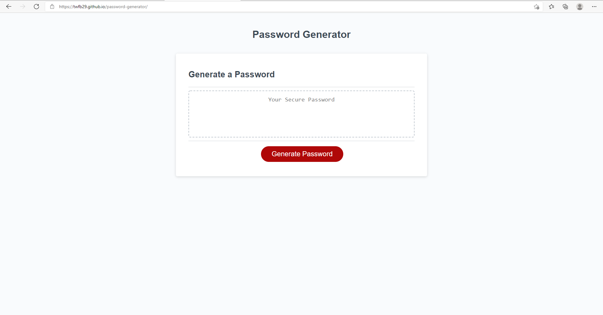

# password-generator
This application will randomly generate a secure password for you.
You will be presented with a series of questions to tailer your password to fit a criteria that you deem acceptable.
During this process you will be presented with a prompt to set the number of characters that you want your password to contain.
Your next series of events will contain a couple of alerts to help you decide what type of characters you want your password to have.
After you have entered your accepted parameters you will be presented with your randomly generated secure password.
